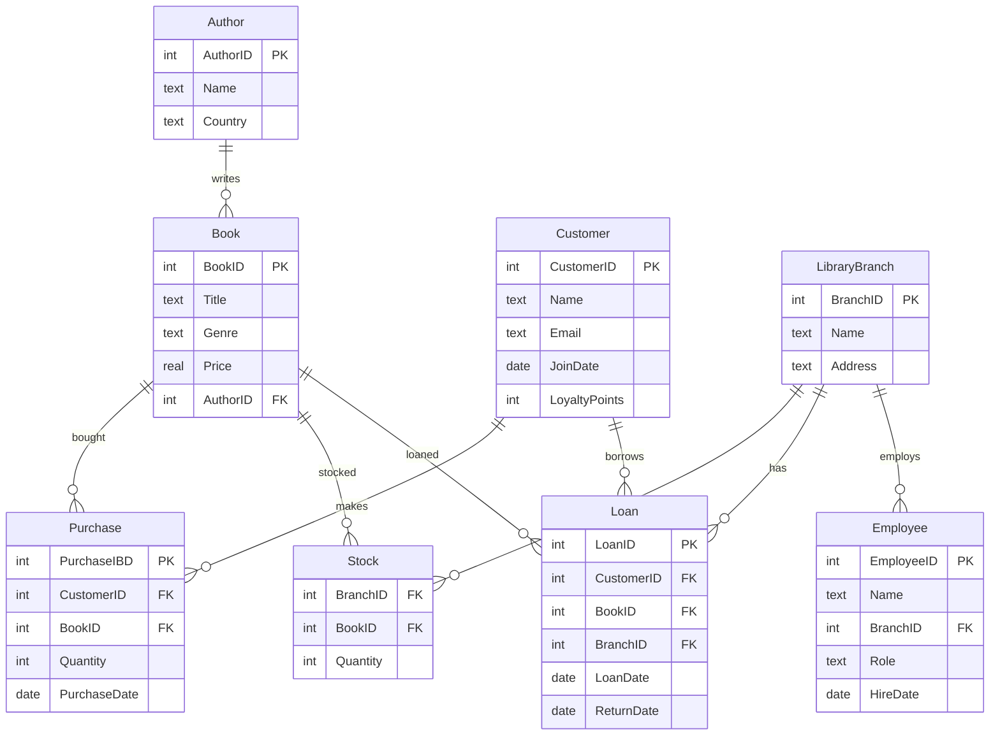

# 📚 Bookstore & Library Database

This Markdown document defines the **Bookstore & Library DB**, including SQL schema creation, sample data, and query examples (from beginner to advanced).
---
## 🧩 ER Diagram (Mermaid)



---

## 🗃️ Database Setup

### 🧹 Drop Existing Tables
```sql
DROP TABLE IF EXISTS Loan, Stock, Purchase, Employee, Customer, Book, Author, LibraryBranch;
````

---

## 📖 Tables and Sample Data

### 🧍‍♂️ AUTHOR

```sql
CREATE TABLE Author (
    AuthorID INTEGER PRIMARY KEY,
    Name TEXT,
    Country TEXT
);

INSERT INTO Author VALUES
(1, 'J.K. Rowling', 'UK'),
(2, 'George R.R. Martin', 'USA'),
(3, 'Haruki Murakami', 'Japan');
```

---

### 📚 BOOK

```sql
CREATE TABLE Book (
    BookID INTEGER PRIMARY KEY,
    Title TEXT,
    Genre TEXT,
    Price REAL,
    AuthorID INTEGER,
    FOREIGN KEY (AuthorID) REFERENCES Author(AuthorID)
);

INSERT INTO Book VALUES
(1, 'Harry Potter and the Philosopher''s Stone', 'Fantasy', 12.5, 1),
(2, 'A Game of Thrones', 'Fantasy', 15.0, 2),
(3, 'Kafka on the Shore', 'Magical Realism', 14.0, 3),
(4, 'Harry Potter and the Chamber of Secrets', 'Fantasy', 13.0, 1),
(5, '1Q84', 'Fiction', 16.0, 3);
```

---

### 🧑‍🤝‍🧑 CUSTOMER

```sql
CREATE TABLE Customer (
    CustomerID INTEGER PRIMARY KEY,
    Name TEXT,
    Email TEXT,
    JoinDate DATE,
    LoyaltyPoints INTEGER
);

INSERT INTO Customer VALUES
(1, 'Alice Smith', 'alice@example.com', '2023-01-15', 50),
(2, 'Bob Johnson', 'bob@example.com', '2023-03-20', 30),
(3, 'Charlie Lee', 'charlie@example.com', '2023-05-10', 45);
```

---

### 💳 PURCHASE

```sql
CREATE TABLE Purchase (
    PurchaseID INTEGER PRIMARY KEY,
    CustomerID INTEGER,
    BookID INTEGER,
    Quantity INTEGER,
    PurchaseDate DATE,
    FOREIGN KEY (CustomerID) REFERENCES Customer(CustomerID),
    FOREIGN KEY (BookID) REFERENCES Book(BookID)
);

INSERT INTO Purchase VALUES
(1, 1, 1, 1, '2023-06-01'),
(2, 1, 2, 2, '2023-06-15'),
(3, 2, 3, 1, '2023-07-10'),
(4, 3, 4, 1, '2023-08-05'),
(5, 2, 5, 2, '2023-08-20');
```

---

### 🏢 LIBRARY BRANCH

```sql
CREATE TABLE LibraryBranch (
    BranchID INTEGER PRIMARY KEY,
    Name TEXT,
    Address TEXT
);

INSERT INTO LibraryBranch VALUES
(1, 'Central Library', '123 Main St'),
(2, 'North Branch', '456 North Rd'),
(3, 'East Branch', '789 East Ave');
```

---

### 📦 STOCK

```sql
CREATE TABLE Stock (
    BranchID INTEGER,
    BookID INTEGER,
    Quantity INTEGER,
    FOREIGN KEY (BranchID) REFERENCES LibraryBranch(BranchID),
    FOREIGN KEY (BookID) REFERENCES Book(BookID)
);

INSERT INTO Stock VALUES
(1, 1, 5),
(1, 2, 3),
(2, 3, 4),
(2, 4, 2),
(3, 5, 6);
```

---

### 👨‍💼 EMPLOYEE

```sql
CREATE TABLE Employee (
    EmployeeID INTEGER PRIMARY KEY,
    Name TEXT,
    BranchID INTEGER,
    Role TEXT,
    HireDate DATE,
    FOREIGN KEY (BranchID) REFERENCES LibraryBranch(BranchID)
);

INSERT INTO Employee VALUES
(1, 'David Green', 1, 'Manager', '2023-01-01'),
(2, 'Ella Brown', 1, 'Cashier', '2023-02-15'),
(3, 'Frank White', 2, 'Manager', '2023-03-20');
```

---

### 📘 LOAN

```sql
CREATE TABLE Loan (
    LoanID INTEGER PRIMARY KEY,
    CustomerID INTEGER,
    BookID INTEGER,
    BranchID INTEGER,
    LoanDate DATE,
    ReturnDate DATE,
    FOREIGN KEY (CustomerID) REFERENCES Customer(CustomerID),
    FOREIGN KEY (BookID) REFERENCES Book(BookID),
    FOREIGN KEY (BranchID) REFERENCES LibraryBranch(BranchID)
);

INSERT INTO Loan VALUES
(1, 1, 1, 1, '2023-09-01', '2023-09-15'),
(2, 2, 3, 2, '2023-09-05', '2023-09-20'),
(3, 3, 4, 2, '2023-09-10', NULL);
```

---

## 💡 Queries

### 🟢 Beginner

```sql
-- List all book titles and prices.
SELECT Title, Price FROM Book;

-- Show all customers with LoyaltyPoints > 40.
SELECT * FROM Customer WHERE LoyaltyPoints > 40;

-- Display all branches and their addresses.
SELECT Name, Address FROM LibraryBranch;

-- Show stock quantities of each book at Central Library.
SELECT Quantity FROM Stock;
```

---

### 🟡 Intermediate

```sql
-- Count the number of purchases per customer.
SELECT c.CustomerID, SUM(p.Quantity)
FROM Customer c
JOIN Purchase p USING (CustomerID)
GROUP BY c.CustomerID;

-- List all books with genre 'Fantasy'.
SELECT * FROM Book WHERE Genre = 'Fantasy';

-- Show employees and their branch names.
SELECT e.Name, b.Name
FROM Employee e, LibraryBranch b
WHERE e.BranchID = b.BranchID;

-- Calculate total books purchased by Alice Smith.
SELECT SUM(Quantity)
FROM Purchase
JOIN Customer USING (CustomerID)
WHERE Customer.Name = 'Alice Smith'
GROUP BY CustomerID;

-- List all loans that are not yet returned.
SELECT * FROM Loan WHERE ReturnDate IS NULL;

-- Show average book price per genre.
SELECT AVG(Price)
FROM Book
GROUP BY Genre;
```

---

### 🔵 Advanced

```sql
-- Find the top 2 customers by total purchases.
SELECT c.Name, SUM(b.Price)
FROM Customer c, Purchase p, Book b
WHERE c.CustomerID = p.CustomerID AND p.BookID = b.BookID
GROUP BY c.CustomerID
ORDER BY SUM(b.Price) DESC
LIMIT 2;

-- Show total revenue per branch.
SELECT br.Name, SUM(b.Price * p.Quantity)
FROM LibraryBranch br, Book b, Purchase p, Stock s
WHERE br.BranchID = s.BranchID AND s.BookID = b.BookID AND b.BookID = p.BookID
GROUP BY br.BranchID;

-- List authors and the number of books they have in stock.
SELECT a.Name, s.Quantity
FROM Author a, Book b, Stock s
WHERE a.AuthorID = b.AuthorID AND b.BookID = s.BookID;

-- Find the branch with the highest number of unreturned loans.
SELECT b.Name, COUNT(*) AS UnreturnedLoans
FROM LibraryBranch b
JOIN Loan l ON b.BranchID = l.BranchID
WHERE l.ReturnDate IS NULL
GROUP BY b.BranchID
ORDER BY UnreturnedLoans DESC
LIMIT 1;
```

---

### 🧠 Special Queries

#### CASE Expression

```sql
-- Label books by price category.
SELECT Title, Price,
CASE
    WHEN Price < 13 THEN 'Cheap'
    WHEN Price BETWEEN 13 AND 15 THEN 'Moderate'
    ELSE 'Expensive'
END AS PriceCategory
FROM Book;
```

#### Window Function

```sql
-- Show cumulative purchases per customer ordered by date.
SELECT 
    p1.CustomerID,
    p1.PurchaseDate,
    (
        SELECT SUM(p2.Quantity)
        FROM Purchase p2
        WHERE p2.CustomerID = p1.CustomerID
          AND p2.PurchaseDate <= p1.PurchaseDate
    ) AS CumulativeQuantity
FROM Purchase p1
ORDER BY p1.CustomerID, p1.PurchaseDate;
```

#### Subquery

```sql
-- List customers who bought all books by J.K. Rowling.
SELECT Name
FROM Customer
WHERE CustomerID IN (
    SELECT p.CustomerID
    FROM Purchase p
    JOIN Book b ON p.BookID = b.BookID
    JOIN Author a ON b.AuthorID = a.AuthorID
    WHERE a.Name = 'J.K. Rowling'
    GROUP BY p.CustomerID
    HAVING COUNT(DISTINCT b.BookID) = (
        SELECT COUNT(*) 
        FROM Book 
        WHERE AuthorID = (SELECT AuthorID FROM Author WHERE Name='J.K. Rowling')
    )
);
```

---
