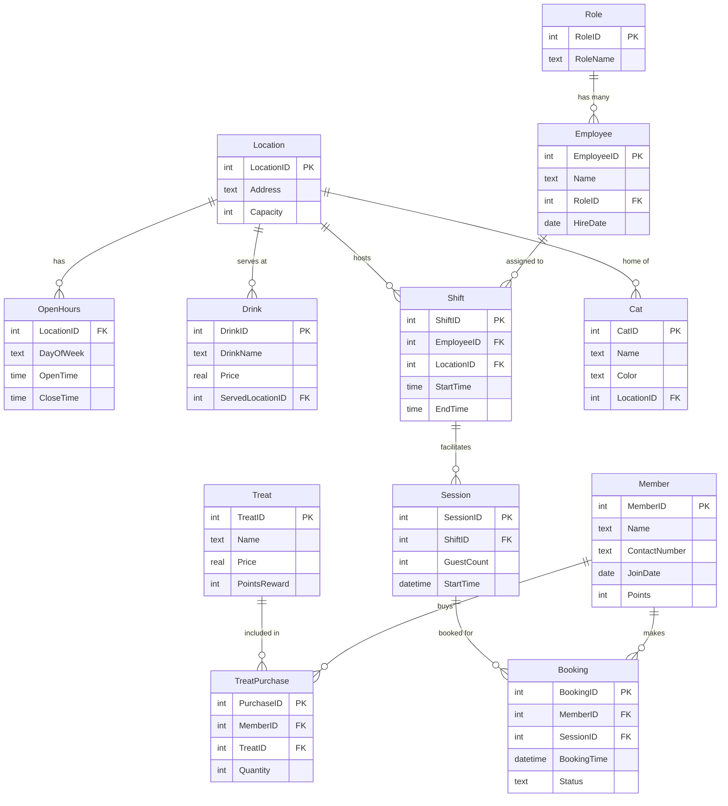

# 🐾 Pet Café Database (Skill Exercise)

This file includes:
- Database creation and inserts  
- Beginner, Intermediate, and Advanced SQL queries  
- Practice exercises with examples of `JOIN`, `GROUP BY`, `HAVING`, and aggregate functions  

---

---

## 🧹 Drop Tables (for clean reruns)
```sql
DROP TABLE IF EXISTS TreatPurchase, Booking, Session, Shift, Employee, Role, Member, Drink, Location, OpenHours, Cat;
```

---

## 🧑‍💼 ROLE

```sql
CREATE TABLE Role (
    RoleID INTEGER PRIMARY KEY,
    RoleName TEXT
);

INSERT INTO Role VALUES
(1, 'Manager'),
(2, 'Barista'),
(3, 'Attendant');
```

---

## 👷 EMPLOYEE

```sql
CREATE TABLE Employee (
    EmployeeID INTEGER PRIMARY KEY,
    Name TEXT,
    RoleID INTEGER,
    HireDate DATE,
    FOREIGN KEY (RoleID) REFERENCES Role(RoleID)
);

INSERT INTO Employee VALUES
(1, 'Larry', 1, '2023-04-10'),
(2, 'Benjamin', 2, '2023-05-15'),
(3, 'Chloe', 3, '2023-08-01');
```

---

## 📍 LOCATION

```sql
CREATE TABLE Location (
    LocationID INTEGER PRIMARY KEY,
    Address TEXT,
    Capacity INTEGER
);

INSERT INTO Location VALUES
(1, '804 George Street, Haymarket NSW 2000', 20),
(2, '591 George Street, Sydney NSW 2000', 15),
(3, '206 Pitt Street, Sydney NSW 2000', 25);
```

---

## 🕒 OPEN HOURS

```sql
CREATE TABLE OpenHours (
    LocationID INTEGER,
    DayOfWeek TEXT,
    OpenTime TIME,
    CloseTime TIME,
    FOREIGN KEY (LocationID) REFERENCES Location(LocationID)
);

INSERT INTO OpenHours VALUES
(1, 'SAT', '09:00:00', '18:00:00'),
(1, 'SUN', '09:00:00', '18:00:00'),
(2, 'SAT', '09:30:00', '19:00:00'),
(2, 'FRI', '12:00:00', '18:30:00'),
(3, 'SAT', '10:00:00', '18:00:00'),
(3, 'WED', '10:00:00', '19:30:00');
```

---

## ☕ DRINK

```sql
CREATE TABLE Drink (
    DrinkID INTEGER PRIMARY KEY,
    DrinkName TEXT,
    Price REAL,
    ServedLocationID INTEGER,
    FOREIGN KEY (ServedLocationID) REFERENCES Location(LocationID)
);

INSERT INTO Drink VALUES
(1, 'Flat White', 4.5, 1),
(2, 'Espresso', 3.5, 1),
(3, 'Still Water', 2.0, 2),
(4, 'Sparkling Water', 3.0, 2),
(5, 'Orange Juice', 4.0, 3),
(6, 'Hot Chocolate', 5.0, 3);
```

---

## 👤 MEMBER

```sql
CREATE TABLE Member (
    MemberID INTEGER PRIMARY KEY,
    Name TEXT,
    ContactNumber TEXT,
    JoinDate DATE,
    Points INTEGER
);

INSERT INTO Member VALUES
(1, 'Sophie Williams', '284587123', '2023-09-06', 15),
(2, 'Emma Davis', '745732857', '2023-09-10', 26),
(3, 'Harper Young', '287582934', '2023-10-01', 20),
(4, 'Eleanor Foster', '986854737', '2023-08-20', 18),
(5, 'Benjamin King', '935221326', '2023-09-09', 22);
```

---

## 🦴 TREAT

```sql
CREATE TABLE Treat (
    TreatID INTEGER PRIMARY KEY,
    Name TEXT,
    Price REAL,
    PointsReward INTEGER
);

INSERT INTO Treat VALUES
(1, 'Salmon creamy puree', 5.5, 5),
(2, 'Chicken creamy puree', 5.0, 5),
(3, 'Tuna & prawn creamy puree', 5.2, 5),
(4, 'Sardine creamy puree', 4.99, 5),
(5, 'Chicken flavoured dry biscuits', 3.0, 3),
(6, 'Mackerel flavoured biscuits', 3.5, 3);
```

---

## 🛍️ TREAT PURCHASE

```sql
CREATE TABLE TreatPurchase (
    PurchaseID INTEGER PRIMARY KEY,
    MemberID INTEGER,
    TreatID INTEGER,
    Quantity INTEGER,
    FOREIGN KEY (MemberID) REFERENCES Member(MemberID),
    FOREIGN KEY (TreatID) REFERENCES Treat(TreatID)
);

INSERT INTO TreatPurchase VALUES
(1, 1, 1, 2),
(2, 2, 2, 1),
(3, 3, 5, 3),
(4, 4, 3, 1),
(5, 5, 6, 4);
```

---

## ⏰ SHIFT

```sql
CREATE TABLE Shift (
    ShiftID INTEGER PRIMARY KEY,
    EmployeeID INTEGER,
    LocationID INTEGER,
    StartTime TIME,
    EndTime TIME,
    FOREIGN KEY (EmployeeID) REFERENCES Employee(EmployeeID),
    FOREIGN KEY (LocationID) REFERENCES Location(LocationID)
);

INSERT INTO Shift VALUES
(1, 1, 1, '09:00:00', '12:30:00'),
(2, 2, 2, '10:00:00', '15:00:00'),
(3, 2, 3, '09:30:00', '14:30:00'),
(4, 3, 1, '13:00:00', '19:00:00');
```

---

## 🪑 SESSION

```sql
CREATE TABLE Session (
    SessionID INTEGER PRIMARY KEY,
    ShiftID INTEGER,
    GuestCount INTEGER,
    StartTime DATETIME,
    FOREIGN KEY (ShiftID) REFERENCES Shift(ShiftID)
);

INSERT INTO Session VALUES
(1, 1, 5, '2023-12-28 09:30:00'),
(2, 1, 4, '2023-12-28 10:30:00'),
(3, 2, 3, '2023-12-29 11:00:00'),
(4, 3, 2, '2023-12-30 09:30:00'),
(5, 4, 1, '2023-12-30 14:00:00');
```

---

## 📅 BOOKING

```sql
CREATE TABLE Booking (
    BookingID INTEGER PRIMARY KEY,
    MemberID INTEGER,
    SessionID INTEGER,
    BookingTime DATETIME,
    Status TEXT,
    FOREIGN KEY (MemberID) REFERENCES Member(MemberID),
    FOREIGN KEY (SessionID) REFERENCES Session(SessionID)
);

INSERT INTO Booking VALUES
(1, 1, 1, '2023-12-24 10:00:00', 'Confirmed'),
(2, 1, 2, '2023-12-27 12:00:00', 'Confirmed'),
(3, 2, 3, '2023-12-28 09:00:00', 'Confirmed'),
(4, 3, 3, '2023-12-29 13:00:00', 'Pending'),
(5, 4, 4, '2023-12-29 14:00:00', 'Confirmed'),
(6, 5, 5, '2023-12-30 10:00:00', 'Confirmed');
```

---

## 🐱 CAT

```sql
CREATE TABLE Cat (
    CatID INTEGER PRIMARY KEY,
    Name TEXT,
    Color TEXT,
    LocationID INTEGER,
    FOREIGN KEY (LocationID) REFERENCES Location(LocationID)
);

INSERT INTO Cat VALUES
(1, 'Milo', 'Black', 1),
(2, 'Luna', 'White', 2),
(3, 'Oliver', 'Ginger', 3);
```

---

# 🎓 PRACTICE QUESTIONS

---

## 🟢 Beginner Level

### 1️⃣ Find the names and prices of treats that cost 4 or more.

```sql
SELECT Name, Price
FROM Treat
WHERE Price >= 4;
```

### 2️⃣ List all treats that have the letter ‘a’ in their name.

```sql
SELECT Name
FROM Treat
WHERE Name LIKE '%a%';
```

### 3️⃣ Find contact numbers of members who have less than 23 points and joined after ‘2023-09-05’.

```sql
SELECT ContactNumber
FROM Member
WHERE Points < 23 AND JoinDate > '2023-09-05';
```

### 4️⃣ Show address, day, and opening time of locations where closing time < ‘19:00:00’, sorted by day.

```sql
SELECT Address, DayOfWeek, OpenTime
FROM Location
JOIN OpenHours USING(LocationID)
WHERE CloseTime < '19:00:00'
ORDER BY DayOfWeek ASC;
```

### 5️⃣ Show each session’s guest count, shift duration (hours), and employee name, only if duration < 5.5h.

```sql
SELECT s.GuestCount,
       TIMESTAMPDIFF(MINUTE, sh.StartTime, sh.EndTime)/60.0 AS 'Shift Duration',
       e.Name
FROM Session s
JOIN Shift sh USING(ShiftID)
JOIN Employee e ON sh.EmployeeID = e.EmployeeID
WHERE TIMESTAMPDIFF(MINUTE, sh.StartTime, sh.EndTime)/60.0 < 5.5;
```

---

## 🟡 Intermediate Level

### 1️⃣ List drink names, location addresses, and open times on Saturday (‘SAT’).

```sql
SELECT DrinkName, Address, OpenTime
FROM Drink d
JOIN Location l ON d.ServedLocationID = l.LocationID
JOIN OpenHours o ON l.LocationID = o.LocationID
WHERE o.DayOfWeek = 'SAT';
```

### 2️⃣ Find the average guest count of all sessions booked before '2023-12-29 13:30:00'.

```sql
SELECT AVG(GuestCount)
FROM Session
JOIN Booking USING(SessionID)
WHERE BookingTime < '2023-12-29 13:30:00';
```

### 3️⃣ List member names and number of bookings after '2023-12-25'.

```sql
SELECT Name, COUNT(BookingID)
FROM Member
JOIN Booking USING(MemberID)
WHERE BookingTime > '2023-12-25'
GROUP BY MemberID;
```

### 4️⃣ Only show members with more than 1 booking.

```sql
SELECT Name, COUNT(BookingID)
FROM Member
JOIN Booking USING(MemberID)
GROUP BY MemberID
HAVING COUNT(BookingID) > 1;
```

### 5️⃣ Find average price of all treats.

```sql
SELECT AVG(Price) AS 'Average Treat Price'
FROM Treat;
```

### 6️⃣ Show employee names and number of shifts they’ve facilitated.

```sql
SELECT Name, COUNT(ShiftID)
FROM Employee e
JOIN Shift sh USING(EmployeeID)
GROUP BY e.EmployeeID;
```

---

## 🔵 Advanced Level

### 1️⃣ Find total treat quantity purchased per member (only if total > 3).

```sql
SELECT SUM(Quantity) AS 'Total Quantity'
FROM TreatPurchase
GROUP BY MemberID
HAVING SUM(Quantity) > 3;
```

### 2️⃣ Show members and their total reward points from treat purchases.

```sql
SELECT m.Name, (t.PointsReward * tp.Quantity) AS 'Total Reward Points'
FROM Member m
JOIN TreatPurchase tp USING(MemberID)
JOIN Treat t USING(TreatID);
```

### 3️⃣ Find average guest count of sessions handled by employees hired after ‘2023-07-01’.

```sql
SELECT AVG(GuestCount)
FROM Session s
JOIN Shift sh USING(ShiftID)
JOIN Employee e USING(EmployeeID)
WHERE e.HireDate > '2023-07-01'
GROUP BY e.EmployeeID;
```

### 4️⃣ List members, treat names, and prices for members who bought treats costing > 5.00.

```sql
SELECT m.MemberID, t.Name, t.Price
FROM Member m
JOIN TreatPurchase tp USING(MemberID)
JOIN Treat t USING(TreatID)
WHERE t.Price > 5;
```

### 5️⃣ Show session IDs, employee names, and locations where shift duration < 4 hours.

```sql
SELECT s.SessionID, e.Name, l.Address
FROM Session s
JOIN Shift sh USING(ShiftID)
JOIN Employee e USING(EmployeeID)
JOIN Location l USING(LocationID)
WHERE TIMESTAMPDIFF(HOUR, sh.StartTime, sh.EndTime) < 4;
```

