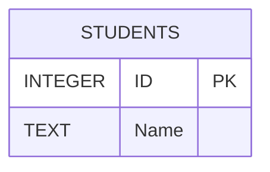

# 🧑‍🎓 SQL Pattern Matching Practice — Students Table

## 🗃️ Table Setup

```sql
CREATE TABLE Students (
    ID INTEGER PRIMARY KEY,
    Name TEXT
);

INSERT INTO Students (ID, Name) VALUES
(1, 'Sam'),
(2, 'Sara'),
(3, 'Sandy'),
(4, 'Sonia'),
(5, 'Arun'),
(6, 'Hasan'),
(7, 'Tomas'),
(8, 'Rosa'),
(9, 'Chris'),
(10, 'Jason'),
(11, 'Sumi'),
(12, 'Lina'),
(13, 'Nasir'),
(14, 'Sia'),
(15, 'Sean'),
(16, 'So');
```

---

## 🧩 ER Diagram (Mermaid)



This simple entity shows the `Students` table with two attributes:

* **ID** → Primary Key
* **Name** → Student name

---

## 🟢 Basic (Easy)

```sql
-- 1️⃣ Show all names that start with “S”.
SELECT Name
FROM Students
WHERE Name LIKE 'S%';

-- 2️⃣ Show all names that end with “s”.
SELECT Name
FROM Students
WHERE Name LIKE '%s';

-- 3️⃣ Show all names that contain the letter “a” anywhere.
SELECT Name
FROM Students
WHERE Name LIKE '%a%';

-- 4️⃣ Show all names that start with “S” and have exactly 3 letters.
SELECT Name
FROM Students
WHERE Name LIKE 'S__';

-- 5️⃣ Show all names that start with “S” and have more than 3 letters.
SELECT Name
FROM Students
WHERE Name LIKE 'S__%';
```

---

## 🟠 Intermediate

```sql
-- 6️⃣ Show all names that have “a” as the second letter.
SELECT Name
FROM Students
WHERE Name LIKE '_a%';

-- 7️⃣ Show all names that have “n” as the third letter.
SELECT Name
FROM Students
WHERE Name LIKE '__n%';

-- 8️⃣ Show all names that contain “an” together (e.g., “Sandy”).
SELECT Name
FROM Students
WHERE Name LIKE '%an%';

-- 9️⃣ Show all names that start with “A” or “S”.
SELECT Name
FROM Students
WHERE Name LIKE 'A%' OR Name LIKE 'S%';

-- 🔟 Show all names that do not contain “s” (case-insensitive).
SELECT Name
FROM Students
WHERE LOWER(Name) NOT LIKE '%s%';
```

---

## 🔵 Advanced (Challenging)

```sql
-- 11️⃣ Show all names that start with “S” and end with “a”.
SELECT Name
FROM Students
WHERE Name LIKE 'S%' AND Name LIKE '%a';

-- 12️⃣ Show all names that contain exactly 4 letters.
SELECT Name
FROM Students
WHERE Name LIKE '____';

-- 13️⃣ Show all names that have “s” as the second-last (last but one) letter.
SELECT Name
FROM Students
WHERE Name LIKE '%s_';

-- 14️⃣ Show all names that start with “R” or “T”.
-- ✅ Correct method: Use REGEXP or multiple LIKE
-- Using REGEXP (works in MySQL 8+)
SELECT Name
FROM Students
WHERE Name REGEXP '^[RT]';

-- Or equivalently:
SELECT Name
FROM Students
WHERE Name LIKE 'R%' OR Name LIKE 'T%';

-- 15️⃣ Show all names that start with any letter between A and L.
-- ✅ The BETWEEN approach doesn't work with LIKE patterns. Use REGEXP.
SELECT Name
FROM Students
WHERE Name REGEXP '^[A-L]';
```
