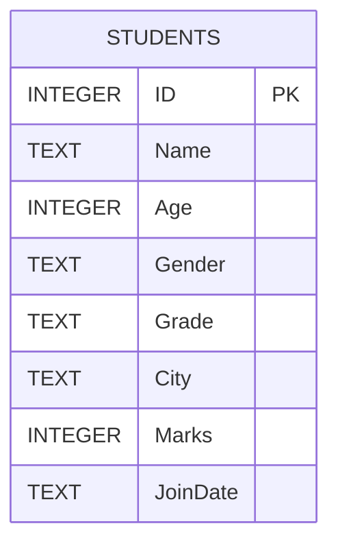

# 🧮 SQL Practice — Filtering and Conditions (`WHERE`)

## 🗃️ Table Definition

```sql
CREATE TABLE Students(
    ID INTEGER PRIMARY KEY,
    Name TEXT,
    Age INTEGER,
    Gender TEXT,
    Grade TEXT,
    City TEXT,
    Marks INTEGER,
    JoinDate TEXT
);

INSERT INTO Students (ID, Name, Age, Gender, Grade, City, Marks, JoinDate) VALUES 
(1, 'Sam', 18, 'M', 'A', 'Sydney', 85, '2023-02-10'),
(2, 'Sara', 19, 'F', 'B', 'Melbourne', 75, '2023-05-03'),
(3, 'Sumi', 18, 'F', 'A', 'Brisbane', 92, '2022-11-11'),
(4, 'Jason', 20, 'M', 'C', 'Perth', 65, '2023-08-19'),
(5, 'Arun', 21, 'M', 'B', 'Sydney', 70, '2024-01-22'),
(6, 'Rosa', 19, 'F', 'A', 'Adelaide', 88, '2023-09-01'),
(7, 'Nasir', 22, 'M', 'C', 'Sydney', 55, '2024-02-15'),
(8, 'Sia', 18, 'F', NULL, 'Melbourne', 80, '2023-03-07');
```

---

## 📊 Sample Table

| ID | Name  | Age | Gender | Grade | City      | Marks | JoinDate   |
| -- | ----- | --- | ------ | ----- | --------- | ----- | ---------- |
| 1  | Sam   | 18  | M      | A     | Sydney    | 85    | 2023-02-10 |
| 2  | Sara  | 19  | F      | B     | Melbourne | 75    | 2023-05-03 |
| 3  | Sumi  | 18  | F      | A     | Brisbane  | 92    | 2022-11-11 |
| 4  | Jason | 20  | M      | C     | Perth     | 65    | 2023-08-19 |
| 5  | Arun  | 21  | M      | B     | Sydney    | 70    | 2024-01-22 |
| 6  | Rosa  | 19  | F      | A     | Adelaide  | 88    | 2023-09-01 |
| 7  | Nasir | 22  | M      | C     | Sydney    | 55    | 2024-02-15 |
| 8  | Sia   | 18  | F      | NULL  | Melbourne | 80    | 2023-03-07 |

---

## 🧩 ER Diagram (Mermaid)



---

## 🟢 1. Comparison Operators (`=`, `!=`, `<`, `>`, `<=`, `>=`)

```sql
-- Show all students whose age is greater than 18.
SELECT * FROM Students WHERE Age > 18;

-- Show all students whose marks are less than or equal to 80.
SELECT * FROM Students WHERE Marks <= 80;

-- Show all students who are not from Sydney.
SELECT * FROM Students WHERE City != 'Sydney';

-- Show all students with Grade = 'A'.
SELECT * FROM Students WHERE Grade = 'A';

-- Show all students whose marks are not equal to 70.
SELECT * FROM Students WHERE Marks != 70;
```

---

## 🟠 2. Logical Operators (`AND`, `OR`, `NOT`)

```sql
-- Show students who are from Sydney and have marks above 80.
SELECT * FROM Students
WHERE City = 'Sydney' AND Marks > 80;

-- Show students who are from Melbourne or Adelaide.
SELECT * FROM Students
WHERE City IN ('Melbourne', 'Adelaide');

-- Show students who are not in Grade 'C'.
SELECT * FROM Students
WHERE Grade != 'C';

-- Show students who are not from Sydney and have marks below 90.
SELECT * FROM Students
WHERE City != 'Sydney' AND Marks < 90;

-- Show students whose city is Sydney or Grade is 'A'.
SELECT * FROM Students
WHERE City = 'Sydney' OR Grade = 'A';
```

---

## 🔵 3. Range Filtering (`BETWEEN` / `NOT BETWEEN`)

```sql
-- Show students whose marks are between 70 and 90.
SELECT * FROM Students
WHERE Marks BETWEEN 70 AND 90;

-- Show students whose age is NOT between 18 and 20.
SELECT * FROM Students
WHERE Age NOT BETWEEN 18 AND 20;

-- Show students who joined between '2023-01-01' and '2023-12-31'.
SELECT * FROM Students
WHERE JoinDate BETWEEN '2023-01-01' AND '2023-12-31';
```

---

## 🟣 4. List Filtering (`IN` / `NOT IN`)

```sql
-- Show students whose city is in ('Sydney', 'Melbourne', 'Perth').
SELECT * FROM Students 
WHERE City IN ('Sydney', 'Melbourne', 'Perth');

-- Show students whose Grade is NOT in ('A', 'B').
SELECT * FROM Students
WHERE Grade NOT IN ('A', 'B');

-- Show students whose ID is in (2, 4, 6).
SELECT * FROM Students
WHERE ID IN (2, 4, 6);
```

---

## 🟤 5. Checking for `NULL` Values

```sql
-- Show students whose Grade is NULL.
SELECT * FROM Students
WHERE Grade IS NULL;

-- Show students whose Grade is NOT NULL.
SELECT * FROM Students
WHERE Grade IS NOT NULL;
```

---

## 🔴 6. Pattern Matching (`LIKE` / `NOT LIKE`)

```sql
-- Show students whose name starts with 'S'.
SELECT * FROM Students
WHERE Name LIKE 'S%';

-- Show students whose name contains 'a' anywhere.
SELECT * FROM Students
WHERE Name LIKE '%a%';

-- Show students whose name does not contain 's'.
SELECT * FROM Students
WHERE LOWER(Name) NOT LIKE '%s%';
```

---

## 🟡 7. Date Conditions

```sql
-- Show students who joined after '2023-06-01'.
SELECT * FROM Students
WHERE JoinDate > '2023-06-01';

-- Show students who joined in 2023.
SELECT * FROM Students
WHERE JoinDate LIKE '2023%';

-- Show students who joined before 2023.
SELECT * FROM Students
WHERE JoinDate < '2023';
```

---

## ⚪ 8. Combined Conditions (Multiple `WHERE` Clauses)

```sql
-- Show all female students from Melbourne with marks above 75.
SELECT * FROM Students
WHERE Gender = 'F' AND City = 'Melbourne' AND Marks > 75;

-- Show all male students from Sydney who have marks below 90.
SELECT * FROM Students
WHERE Gender = 'M' AND City = 'Sydney' AND Marks < 90;

-- Show all students who are either from Sydney or have Grade 'A', but joined after 2023-01-01.
SELECT * FROM Students
WHERE (City = 'Sydney' OR Grade = 'A') AND JoinDate > '2023-01-01';

-- Show all students whose name starts with “S” and marks are between 80–90.
SELECT * FROM Students
WHERE Name LIKE 'S%' AND Marks BETWEEN 80 AND 90;
```

---
